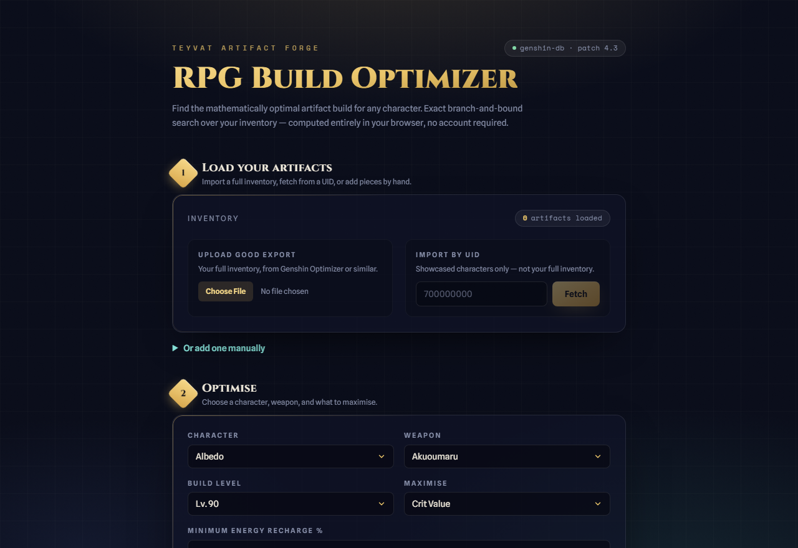

# RPG Build Optimizer

Find the **best five-piece artifact build** for a Genshin Impact character from the gear you actually own — then share it with a single link. Fast, focused, and 100% client-side.

[](https://github.com/natcat38/rpg-build-optimizer/actions/workflows/ci.yml)
[](./LICENSE)

**▶ Live demo:** https://rpg-build-optimizer.vercel.app

<!-- If your Vercel production domain differs, replace the URL above. -->



---

## The problem

In gacha RPGs like Genshin Impact, a character's strength comes mostly from five **artifacts**, each with one main stat and up to four random sub-stats drawn from a large pool. A serious player owns **hundreds**. Finding the best five-piece combination — one that satisfies the bonuses you want (a 4-piece set, an Energy Recharge threshold) and then maximises a damage-relevant stat like Crit Value — is a genuine **combinatorial optimisation problem**. By hand it's slow and error-prone, so most players guess.

This tool does one thing well: _given the artifacts you own, what's the best build for this character under these constraints?_ — and lets you share the result with a link.

## Features

- **Optimise over your real inventory** — import it three ways:
  - **GOOD file** — upload a standard inventory-export `.json` (from any community scanner) for your _entire_ collection.
  - **UID** — fetch the artifacts on your _showcased_ characters via [Enka.Network](https://enka.network) (no login; showcased characters only).
  - **Manual entry** — add/edit artifacts by hand.
- **Define what "best" means** — pick a character, weapon, and build level; set constraints (minimum Energy Recharge, etc.); choose one stat to **maximise** (Crit Value, Elemental Mastery, ATK%, …).
- **Provably optimal results** — an exact search returns the genuine top builds (not a heuristic guess), each with its full resulting stat sheet.
- **Shareable links** — every build encodes into a self-contained URL. Open the link and you see the exact build — no account, nothing stored server-side.
- **Try with example gear** — no inventory? One click loads a curated sample inventory, picks a character + a representative constraint, and runs the optimiser, landing you straight on ranked results.

## How it works

The interesting part is the optimiser. Brute-forcing every five-piece combination explodes for large inventories (40 per slot ≈ 100M combinations). Instead the app uses a **pruned branch-and-bound search**: it walks the slots in order and skips any branch whose best _possible_ completion can't beat the current top-K — collapsing the search to a few thousand explored nodes while still returning the **exact** optimum.

Correctness isn't assumed — it's tested: a brute-force oracle is run against the optimiser across many randomised inventories (including a set-bonus edge case) to prove the pruning never discards the true best build.

A few deliberate design decisions (full rationale in [`docs/adr/`](./docs/adr)):

- **100% client-side** ([ADR-0001](./docs/adr/0001-client-side-only-architecture.md)) — no backend, no accounts; the heavy search runs in a **Web Worker** so the UI never blocks.
- **Stat-only model, no damage engine** ([ADR-0003](./docs/adr/0003-stat-only-model-no-damage-engine.md)) — it maximises a chosen _stat_ under constraints rather than modelling in-game DPS. This keeps it fast, explainable, and correct for every character with zero per-character maintenance. (Consequence: conditional/non-stat 4-piece set effects are honoured as a _constraint_ but not _scored_.)
- **Frozen reference data behind a concrete adapter** ([ADR-0002](./docs/adr/0002-frozen-bundled-reference-dataset.md), [ADR-0012](./docs/adr/0012-collapse-gameadapter-seam-to-concrete-adapter.md)) — a bundled `genshin-db` snapshot, exposed to the optimiser through the `genshinAdapter` object. (Originally a multi-game `GameAdapter` interface, [ADR-0008](./docs/adr/0008-gameadapter-seam-for-multi-game.md); collapsed to a concrete adapter once it was clear only one game would ship.)
- **Self-contained share links** ([ADR-0005](./docs/adr/0005-self-contained-share-links.md)) — the five full artifacts are embedded (deflate + base64url), so a recipient who doesn't own your inventory still sees the exact pieces.

Domain vocabulary is defined once in [`CONTEXT.md`](./CONTEXT.md).

## Tech stack

Vite · React 18 · TypeScript (strict) · Tailwind CSS · Zustand (state) · Web Workers · Vitest + Testing Library · native `CompressionStream` (URL compression). Deployed static on Vercel; CI via GitHub Actions (typecheck + lint + test + build).

## Local development

```bash
npm install
npm run dev        # start the dev server
npm test           # run the unit-test suite
npm run typecheck  # tsc -b (strict, project references)
npm run lint
npm run build      # production build -> dist/
npm run build:data # regenerate the frozen genshin-db snapshot (build-time only)
npm run bench      # regenerate docs/speed-report.md from the benchmark harness
```

## Project structure

```
src/
  game/        # domain types + frozen Genshin dataset & genshinAdapter
  optimizer/   # pure scoring, feasibility, and the exact branch-and-bound search
  workers/     # the optimise Web Worker + a promise/sync-fallback client
  import/      # GOOD-file parser, Enka UID import, content-hash dedupe
  state/       # Zustand inventory store + artifact validation
  share/       # self-contained build-snapshot URL encode/decode
  components/  # ImportPanel, ArtifactForm, OptimizePanel, Results, BuildCard, App
scripts/
  build-dataset.ts   # extracts the frozen snapshot from genshin-db
docs/
  adr/         # architecture decision records
  superpowers/ # design spec + implementation plan
```

## Performance

The optimiser is an exact branch-and-bound search: it returns the provably optimal
build while evaluating only a sliver of the brute-force space. On a synthetic
800-artifact inventory it explores roughly **1 in 89,043** of the ~105 billion possible
crit-value builds — and a randomised correctness test confirms the pruning never
drops the true optimum.

See [docs/speed-report.md](docs/speed-report.md) for the full numbers, regenerated
any time with `npm run bench`.

## Roadmap

v1.0 shipped the lean optimiser. The **v1.1 depth layer** is landing incrementally:

- ✅ **"Try with example gear"** — one-click sample builds that load a curated inventory and auto-run the optimiser (no import required).
- ✅ **Benchmark / speed report** — a committed, reproducible report (`npm run bench`) proving how little of the brute-force space the search explores.
- ✅ **Gap analysis** — compare your best owned build against a meta target and tell you _what to farm_ to close the gap (the centrepiece).
- ✅ **AI: Explain this build** — an optional Claude-powered plain-English explanation of the optimised build (see below).
- _(planned)_ an end-to-end test and a live "watch it search" visualisation.

See [`docs/superpowers/specs/2026-06-05-depth-layer-and-portfolio-design.md`](./docs/superpowers/specs/2026-06-05-depth-layer-and-portfolio-design.md).

## AI: Explain this build

For supported meta characters, an optional **"Explain this build"** button sits
below the gap report. It sends the best build's stats and the gap report to a
Vercel serverless function (`api/explain.ts`), which calls Claude
(`claude-haiku-4-5`) and returns a 2–3 sentence plain-English explanation. No
personal data is sent (no UID, no inventory).

**Why a serverless proxy?** The Anthropic API key stays server-side. A
`VITE_`-prefixed key would be inlined into the public bundle and leak — see
[ADR-0010](docs/adr/0010-serverless-proxy-for-ai-explain.md).

### Setup / local testing

- Set `ANTHROPIC_API_KEY` as a Vercel project environment variable (server-side).
- Set `VITE_AI_ENABLED=true` to render the button (build-time flag — keep it off
  until the key is deployed).
- Set a spend cap in the Anthropic console (the feature's hard cost ceiling).
- Locally, run `vercel dev` (not `npm run dev`) to serve the `/api` function.

## Data & attribution

Game reference data is derived at build time from the [genshin-db](https://github.com/theBowja/genshin-db) project and bundled as a frozen snapshot. Genshin Impact and all related data are property of HoYoverse; this project bundles only numeric stat/reference data and ships no game assets. See [`DATA_LICENSE`](./DATA_LICENSE).

## License

[MIT](./LICENSE)
