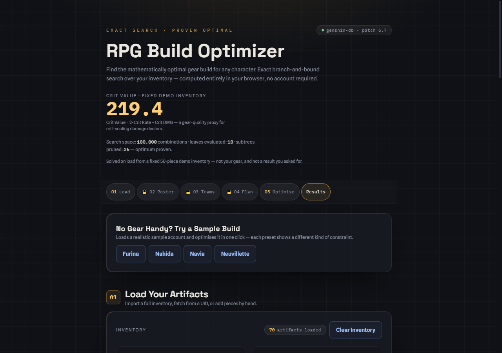

# RPG Build Optimizer

Find the **best five-piece artifact build** for a Genshin Impact character from the gear you actually own — then share it with a single link. Fast, focused, and 100% client-side.

[](https://github.com/natcat38/rpg-build-optimizer/actions/workflows/ci.yml)
[](./LICENSE)

**▶ Live demo:** https://rpg-build-optimizer.vercel.app

<!-- If your Vercel production domain differs, replace the URL above. -->



---

## The problem

In gacha RPGs like Genshin Impact, a character's strength comes mostly from five **artifacts**, each with one main stat and up to four random sub-stats drawn from a large pool. A serious player owns **hundreds**. Finding the best five-piece combination — one that satisfies the bonuses you want (a 4-piece set, an Energy Recharge threshold) and then maximises a damage-relevant stat like Crit Value — is a genuine **combinatorial optimisation problem**. By hand it's slow and error-prone, so most players guess.

This tool does one thing well: _given the artifacts you own, what's the best build for this character under these constraints?_ — and lets you share the result with a link.

## Features

- **Optimise over your real inventory** — import a GOOD-format `.json`, fetch showcased characters by UID via [Enka.Network](https://enka.network), or add pieces by hand.
- **Define what "best" means** — pick a character, weapon, and build level, set constraints, and choose the stat to maximise.
- **Provably optimal results** — an exact search returns the genuine top builds, each with its full stat sheet.
- **Shareable links** — every build encodes into a self-contained URL; no account, nothing stored server-side.
- **Try with example gear** — one click loads a curated sample inventory and runs the optimiser.
- **Roster assessment** — a 0–100 build score for every owned character, broken down into level, talents, weapon, and artifact quality.
- **Abyss team recommendations** — two halves that share no character, matched from curated comp archetypes.
- **Damage-ranked builds** — where a curated damage profile exists, the optimiser maximises estimated average damage instead of a proxy stat, and stays exact.
- **One plan** — optimised builds for all eight members over your shared inventory, plus a "what to farm" list.
- **Investment advice** — which characters and weapons are worth levelling next, from your roster's gaps.

## Quick start

```bash
npm install
npm run dev
```

See [CONTRIBUTING.md](CONTRIBUTING.md) for the full dev workflow, and [FILE-MAP.md](FILE-MAP.md) (auto-generated) for the code layout.

## How it works

The optimiser is an exact branch-and-bound search running in a Web Worker: it walks the slots in order and prunes any branch whose best possible completion can't beat the current top-K, so it returns the provably optimal build while evaluating a sliver of the brute-force space (see [docs/speed-report.md](docs/speed-report.md), regenerated by `npm run bench`). A brute-force oracle test proves the pruning never drops the true optimum.

Every architectural decision and its rationale lives in [`docs/adr/`](./docs/adr); the domain vocabulary is defined once in [`CONTEXT.md`](./CONTEXT.md).

## Tech stack

Vite · React 19 · TypeScript (strict) · Tailwind CSS · Zustand · Web Workers · Vitest + Testing Library · native `CompressionStream`. Deployed static on Vercel; CI via GitHub Actions.

## AI: Explain this build

An optional Claude-powered plain-English explanation of the optimised build, served through a Vercel serverless function so the API key stays server-side ([ADR-0010](docs/adr/0010-serverless-proxy-for-ai-explain.md)). No personal data is sent; setup is in [CONTRIBUTING.md](CONTRIBUTING.md).

## Data & license

Game reference data is derived at build time from [genshin-db](https://github.com/theBowja/genshin-db) and bundled as a frozen snapshot — numeric data only, no game assets ([`DATA_LICENSE`](./DATA_LICENSE)).

Code is [MIT](./LICENSE) licensed. Not affiliated with HoYoverse.
