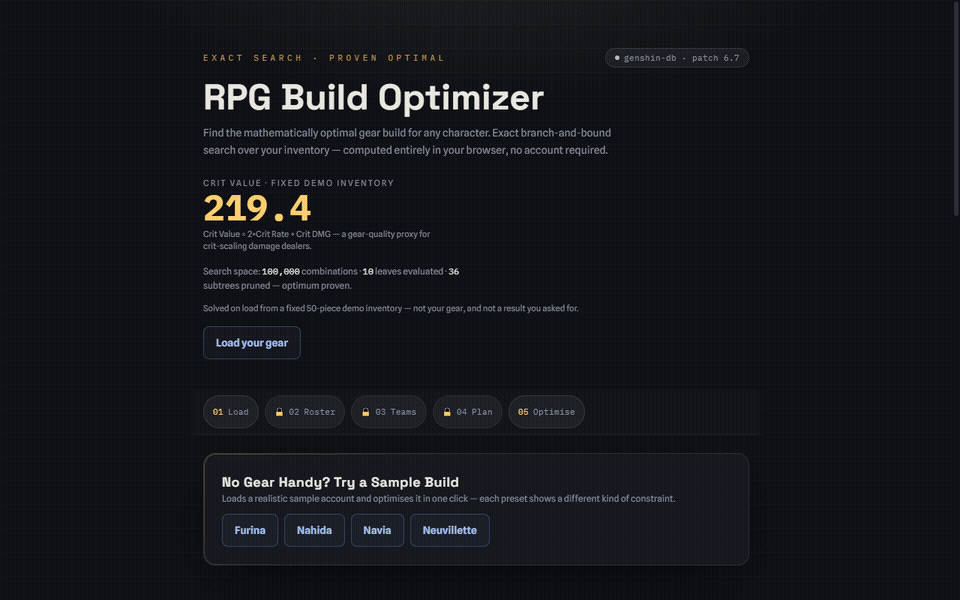

# RPG Build Optimizer

Find the **best five-piece artifact build** for a Genshin Impact character from the gear you actually own — then share it with a single link. Fast, focused, and 100% client-side.

[](https://github.com/natcat38/rpg-build-optimizer/actions/workflows/ci.yml)
[](https://github.com/natcat38/rpg-build-optimizer/actions/workflows/coverage-badge.yml)
[](./LICENSE)

**▶ Live demo:** https://rpg-build-optimizer.vercel.app



---

## The problem

In gacha RPGs like Genshin Impact, a character's strength comes mostly from five **artifacts**, each with one main stat and up to four random sub-stats drawn from a large pool. A serious player owns **hundreds**. Finding the best five-piece combination — one that satisfies the bonuses you want (a 4-piece set, an Energy Recharge threshold) and then maximises a damage-relevant stat like Crit Value — is a genuine **combinatorial optimisation problem**. By hand it's slow and error-prone, so most players guess.

It started as one question: _given the artifacts you own, what's the best build for this character under these constraints?_ It has since grown into the account-level version — score your whole roster, field two Abyss halves that share no character, and plan all eight builds over one shared inventory. Any result shares as a single link.

## Features

- **Optimise over your real inventory** — import a GOOD-format `.json`, fetch showcased characters by UID via [Enka.Network](https://enka.network), or add pieces by hand.
- **Define what "best" means** — pick a character, weapon, and build level, set constraints, and choose the stat to maximise.
- **Provably optimal results** — an exact search returns the genuine top builds, each with its full stat sheet.
- **Shareable links** — every build encodes into a self-contained URL; no account, nothing stored server-side.
- **Try a sample build** — one click loads a curated sample inventory and runs the optimiser.

A GOOD-file upload unlocks the four account-level features — Roster, Teams, Plan, and Investment:

- **Roster assessment** — a 0–100 build score for every owned character, broken down into five components: level, talents, weapon, artifact count, and artifact quality.
- **Abyss team recommendations** — two halves that share no character, matched from curated comp archetypes.
- **Damage-ranked builds** — where a curated damage profile exists, the optimiser maximises estimated average damage instead of a proxy stat, and stays exact.
- **One plan** — optimised builds for all eight members over your shared inventory, plus one farming list.
- **Investment advice** — which characters to pull for and which weapons to craft, ranked by the team-score points each would unlock.

## Quick start

```bash
npm install
npm run dev
```

See [CONTRIBUTING.md](CONTRIBUTING.md) for the full dev workflow, and [FILE-MAP.md](FILE-MAP.md) for the code layout.

## How it works

The optimiser is an exact branch-and-bound search running in a Web Worker: it walks the slots in order and prunes any branch whose best possible completion can't beat the current top-K, so it returns the provably optimal build while evaluating a sliver of the brute-force space (see [docs/speed-report.md](docs/speed-report.md), regenerated by `npm run bench`). A brute-force oracle test proves the returned top-K matches exhaustive enumeration.

Every architectural decision and its rationale lives in [`docs/adr/`](./docs/adr); the domain vocabulary is defined once in [`CONTEXT.md`](./CONTEXT.md).

## Engineering highlights

- **Exact optimisation, proven by test** — the branch-and-bound search is verified against a brute-force oracle: the returned top-K must match exhaustive enumeration, so "provably optimal" is a tested claim, not a slogan ([docs/speed-report.md](docs/speed-report.md)).
- **Zero backend** — imports, the optimiser, roster scoring, and share links all run in the browser; builds encode into self-contained URLs via the native `CompressionStream` API ([ADR-0001](docs/adr/0001-client-side-only-architecture.md)).
- **Off the main thread** — the search runs in a Web Worker with live progress, cancellation, and run-superseding, so the UI never freezes mid-search.
- **CI as a quality gate** — typecheck, lint, format, tests with coverage, a bundle-size budget, and Lighthouse checks all run on every PR to a branch-protected `main`.
- **Decisions are documented** — 20 ADRs record what was built, what was rejected, and why — including complexity that was deliberately removed ([ADR-0012](docs/adr/0012-collapse-gameadapter-seam-to-concrete-adapter.md)).

## Tech stack

Vite · React 19 · TypeScript (strict) · Tailwind CSS · Zustand · Web Workers · Vitest + Testing Library · native `CompressionStream`. Deployed static on Vercel; CI via GitHub Actions. Tokens and component classes: [docs/design-system.md](docs/design-system.md).

## AI: Explain this build

An optional Claude-powered plain-English explanation of the optimised build, served through a Vercel serverless function so the API key stays server-side ([ADR-0010](docs/adr/0010-serverless-proxy-for-ai-explain.md)). No personal data is sent. It sits behind the `VITE_AI_ENABLED` build flag and is **off on the public demo**, because it runs against a personal Anthropic account and every click costs the maintainer money. Enable it locally per [CONTRIBUTING.md](CONTRIBUTING.md).

## Non-goals

- **Full rotation damage simulation** (energy, cooldowns, buff uptime) — the damage objective ranks a character's own artifacts via a closed-form target function, not a rotation sim; that's gcsim's job ([ADR-0016](docs/adr/0016-damage-engine-objective.md)).
- **Public leaderboards or accounts** — the app is 100% client-side with no backend and nothing stored server-side; a build gallery would require introducing one ([ADR-0001](docs/adr/0001-client-side-only-architecture.md)).
- **i18n** — all copy is curated, hand-written English content (labels, meta targets, comp archetypes); translating it is out of scope for a single-maintainer portfolio project.
- **Multi-game support** — the speculative `GameAdapter` seam for a second game was removed as unearned complexity; `genshinAdapter` is now a concrete, Genshin-specific object ([ADR-0012](docs/adr/0012-collapse-gameadapter-seam-to-concrete-adapter.md)).

## Data & license

Game reference data is derived at build time from [genshin-db](https://github.com/theBowja/genshin-db) and bundled as a frozen snapshot — numeric data only, no game assets ([`DATA_LICENSE`](./DATA_LICENSE)). On top of it sits a hand-curated layer transcribed from KQM sources — 52 meta build recipes, 30 comp archetypes, 18 damage profiles — re-verified each patch ([docs/runbooks/patch-refresh.md](docs/runbooks/patch-refresh.md)).

Code is [MIT](./LICENSE) licensed. Not affiliated with HoYoverse.
