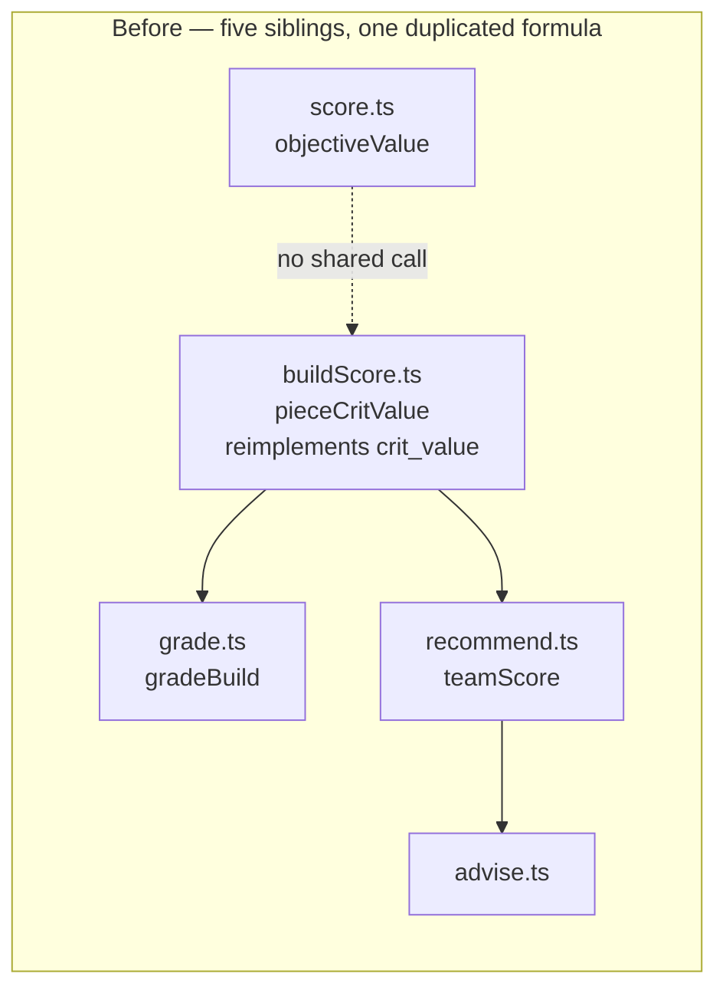
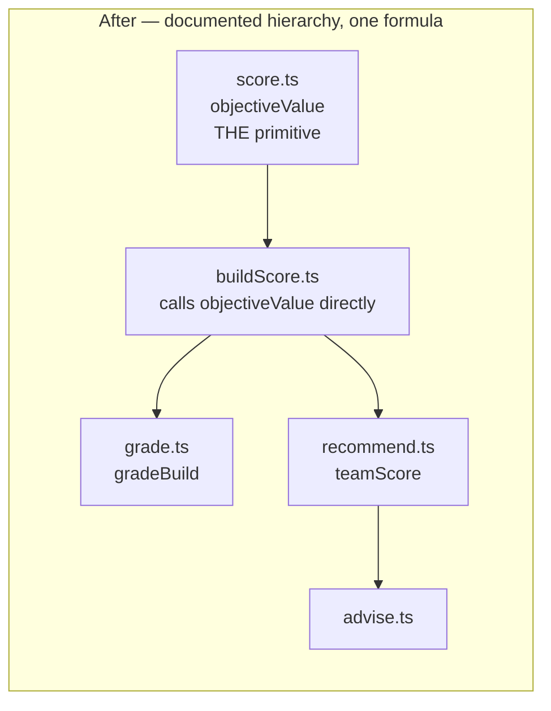

# Architecture audit — 2026-09

Research only. No fixes applied. Produced by walking `CONTEXT.md`'s domain
glossary and all 20 ADRs in `docs/adr/`, then surveying `src/` and `api/` for
deepening opportunities (per the `improve-codebase-architecture` skill's
vocabulary: **module**, **interface**, **depth**, **seam**, **leverage**,
**locality** — see that skill's `LANGUAGE.md` for definitions).

Overall finding: the codebase is in good shape relative to its ADRs — no
ADR-documented constraint has regressed, and the optimizer's admissibility
invariants are exactly as documented. The friction that exists is
concentrated in one place: **"how good is this?" is answered by five
independent, non-cross-referencing modules**, and two curated data tables
(`teammates.ts`, `comps.ts`) have already drifted apart from a shared origin.
Nothing here is a bug; all of it is a comprehension/locality cost that will
compound as more scoring surfaces get added.

---

## 1. Scattered concept: "how good is this?" has five parallel scoring modules

**Files:**
- `src/optimizer/score.ts` — `objectiveValue()`, `evaluateObjective()`, `critValue()`
- `src/roster/buildScore.ts` — `computeBuildScore()`
- `src/meta/grade.ts` — `gradeBuild()`
- `src/teams/recommend.ts` — `teamScore()` (line ~29)
- `src/invest/advise.ts` — reuses `teamScore`'s upside output as a ranking key

**Problem.** CONTEXT.md defines exactly one **Build score** term ("a 0–100
composite of how built a roster character is... with explainable
components") and one **Objective** term (what the optimiser maximises). In
the code, "a build's score" actually means five different things on five
different scales, computed in five files that don't call into each other as
a hierarchy — they sit side by side and occasionally reimplement one
another's arithmetic:

- `objectiveValue` / `critValue` (`score.ts`) — the optimiser's raw ranking
  number: a stat total, `crit_value = cr*2 + cd`, or `avg_damage`.
- `computeBuildScore` (`roster/buildScore.ts`) — the CONTEXT.md "Build score":
  0–100, level/talents/weapon/artifact-count/quality. Its own
  `pieceCritValue()` helper (line 43) is a **second, local reimplementation**
  of `objectiveValue(contribution, 'crit_value')` rather than a call to it —
  the comment even says "the optimiser's own fold, so a roster score and a
  search score can't diverge," acknowledging the coupling without expressing
  it as a dependency.
- `gradeBuild` (`meta/grade.ts`) — a third scale entirely: S/A/B/C/D letter
  grades from mean-of-capped-ratios against `statTargets`.
- `teamScore` (`teams/recommend.ts`) — a fourth number,
  `tierWeight × mean(option.weight × buildScore)`, treating
  `computeBuildScore`'s output as an opaque input.
- `advise.ts` — consumes `teamScore`'s `bestPossibleScore` as a fifth ranking
  key, for a still-different question ("what's worth pulling for").

**Why it's friction.** A reader who wants to answer "how is 'good' defined
in this app" has to open four files and reconcile four numeric scales (a raw
stat objective, a 0–100 composite, a letter grade, a tier-weighted mean) that
share only informal naming. The **deletion test** on `pieceCritValue`: delete
it, and the complexity doesn't vanish — it moves one line, to a direct call
into `score.ts`. That's the signature of a module that *should* be composing
with its sibling rather than restating it. There's no test asserting
`pieceCritValue(a) === objectiveValue(artifactContribution(a), 'crit_value')`
beyond the comment's promise; a future edit to `objectiveValue` could
silently desync the two.

**Solution (sketch, not a proposal to implement yet).** Not "merge into one
function" — CONTEXT.md's own glossary treats "Build score" (roster
investment) and "Objective" (optimiser ranking) as legitimately distinct
domain concepts, so collapsing them would blur real meaning. The deepening
opportunity is narrower: give the *relationship* between these five a home —
e.g. a short module-level doc (or a `src/scoring/README`-style comment
anchored in whichever file is most central) that states the hierarchy
("`objectiveValue` is the primitive; `buildScore`, `gradeBuild`, `teamScore`
are each a different aggregation of it, over different domain concepts"),
and replace `pieceCritValue`'s reimplementation with a direct call so the
"can't diverge" comment becomes true by construction instead of by
discipline.

**Benefits.** Locality: the next scoring surface (there will be one — this
pattern has grown by one file roughly every ADR phase) has a documented
place to look before inventing a sixth. Leverage: removing the
`pieceCritValue` duplication removes one of the two formulas that could
silently drift, matching the discipline ADR-0004's 2026-08-21 amendment
already applied to the optimizer's own bound/score pair.

**Recommendation strength: Worth exploring**

---

## 2. Two curated "who teams with whom" tables have already diverged

**Files:** `src/meta/teammates.ts` (751 lines, `TEAMMATES`) and
`src/teams/comps.ts` (1097 lines, `COMP_ARCHETYPES`).

**Problem.** `comps.ts`'s own header comment states its provenance: "Seeded
by expanding every entry in `src/meta/teammates.ts` into a full archetype."
They have since diverged. Example — Furina:

- `teammates.ts` (line 16 `furina:`) lists a flat, unweighted list of 4
  teammates (Neuvillette, Bennett, Xingqiu, ...), each with a one-sentence
  `why`.
- `comps.ts`'s `neuvillette-mono-hydro` archetype (line 23) structures Furina
  as one *buffer*-role option (weight 1.0) among substitutes Yelan/Xingqiu
  (weight 0.7) — a different role framing and different substitute set than
  `teammates.ts` implies.

`teammates.ts` is consumed only by `OptimizePanel.tsx`'s per-character info
panel (`src/components/OptimizePanel.tsx:33,301`); `comps.ts` drives
`recommendAbyss()` and the Plan page. No test or build-time check enforces
the two stay consistent — CONTEXT.md itself documents this as an accepted
gap ("`TEAMMATES` stays for now... Phase 4's Plan page is where the two
converge," ADR-0017), but that convergence has not happened, and the two
have drifted further apart since ADR-0017 was written (2026-08-20) rather
than toward each other.

**Why it's friction.** This is the "tightly-coupled modules that duplicate
similar logic in parallel" case: two files encode the same domain fact (who
plays well with character X) with different data shapes and no shared
source. A future patch-refresh pass (the runbook ADR-0017 names) fixing one
table has no signal that the other needs the same edit — the exact failure
mode ADR-0015 flagged for GOOD-import roster/weapon matching, but here for
curated content instead of parsed data.

**Solution (sketch).** `archetypesFor(characterKey)` already exists in
`comps.ts`'s query surface (or is a one-function addition) — derive
`OptimizePanel`'s teammate blurb from the character's best-fit archetype
slot instead of maintaining a second table. This is exactly the
"unification ADR-0017 deferred" that CONTEXT.md already names as the
intended endpoint; this finding is evidence the deferral has cost more than
expected.

**Benefits.** Locality: one edit updates both surfaces. Deletion test:
deleting `teammates.ts` and deriving from `comps.ts` should *not* reintroduce
complexity elsewhere, because `comps.ts` is a strict superset of the
information `teammates.ts` carries (role + weight + rationale vs. flat list
+ rationale) — a good sign this was a duplicate, not two distinct needs.

**Recommendation strength: Strong** — ADR-0017 already names this as the
target state; this is executing a decision already made, not proposing a new
one.

---

## 3. `App.tsx` (577 lines) composes five loosely-related concerns

**File:** `src/components/App.tsx`

**Problem.** The component owns, in one file: (a) the optimize **run
lifecycle** — cancellation tokens, supersede/cancel handling
(`runToken`, `currentRun`, `cancelCurrent()`, `runCurrent()`, lines
~187–261); (b) share-link hydration via `decodeBuild` (line 126); (c)
roster-driven default-selection hydration; (d) an accessibility live-region
announcer (`announce()`, lines 178–184, driven by the run lifecycle); and
(e) scroll-spy navigation + section lock/unlock (`scrollToId`, sticky nav,
lines ~281–393).

**Why it's friction.** This is a **locality**, not a **testability**,
finding — `App.test.tsx` (448 lines) already exercises the cancel/supersede
paths directly, so nothing here is untested. The cost is navigability: a
reader who wants to understand "how does cancellation interact with the
announcer" has to read past share-link and scroll-spy code that's unrelated
to that question. The run-lifecycle block (tokens, cancel, supersede,
announce) is a self-contained state machine that doesn't need to live beside
scroll-spy logic to work.

**Solution (sketch).** Extract the run-lifecycle + announcer block
(`runToken`, `currentRun`, `cancelCurrent`, `runCurrent`, `announce`,
`announcement` state) into a `useOptimizeRun()` hook. `App.tsx`'s remaining
job becomes composition and layout, with the hook as a deep module: a small
interface (`{ running, result, runCurrent, cancelCurrent, announcement }`)
hiding the token/supersede bookkeeping.

**Benefits.** Leverage: `useOptimizeRun` becomes independently testable
without mounting the whole page (today's coverage goes through the full
component tree). Locality: a future change to cancellation semantics (e.g.
the Plan page's own 8-solve run lifecycle in `src/plan/` — worth checking
whether it already reimplements a similar token pattern) has one place to
change or to copy from deliberately.

**Recommendation strength: Worth exploring** — real friction, but
lower-value than #1/#2 since it's discovered readability cost, not
duplicated logic or diverging data.

---

## 4. `src/workers/optimizeClient.ts`: the settle/cancel state machine is the least-tested part of a well-tested module

**File:** `src/workers/optimizeClient.ts`, `dispatch()` (lines ~65–156)

**Problem.** `dispatch()` hand-rolls a settle-once state machine across
three handlers (`onmessage`, `onerror`, `onmessageerror`) plus a
no-Worker synchronous fallback that uses `queueMicrotask` to preserve
cancel-before-start semantics (ADR-0001's "falls back to a synchronous call
where no worker is available" per FILE-MAP.md). The pure logic this module
also carries — `buildContext`, `zeroOffElementGoblets` (ADR-0014's
element-zeroing step) — is heavily unit-tested elsewhere; the glue code that
sequences worker messages and cancellation is inherently harder to exercise
because it requires mocking `Worker`.

**Why it's friction.** This is the audit's "pure functions extracted for
testability, but the real bugs hide in how they're called" pattern in
miniature: the parts of this module most likely to have an edge-case bug
(what happens if `cancel()` races `onmessage`? does `onmessageerror` ever
fire in practice, and is it distinguishable from `onerror` at the call
site?) are the parts a mocked-`Worker` test suite is least likely to cover
by accident. Worth a follow-up check (not done here): does
`optimizeClient.test.ts` actually drive `onmessageerror` and the
mid-flight-cancel-during-`queueMicrotask` branch, or only the happy path,
leaving that coverage to rely on `App.test.tsx`'s integration-level
cancel/supersede tests?

**Solution (sketch).** Not a rewrite — the state machine is small enough
that extracting it wholesale would just relocate the problem. The concrete
next step is a **targeted test audit**: enumerate the branches in
`dispatch()` (message success, message with error payload, `onerror`,
`onmessageerror`, cancel-before-worker-created, cancel-after-first-message,
no-Worker fallback + immediate cancel) and confirm each has a direct,
non-integration test. Where gaps exist, they're worth closing before this
file grows further (e.g. if the Plan page's 8-solve loop ever routes through
the same client with a different cancellation shape).

**Recommendation strength: Speculative** — flagged from static reading, not
from confirming a specific gap; verifying the actual test coverage is the
right next step before proposing a structural change.

---

## 5. FILE-MAP.md drift: two directory descriptions undersell what's actually there

**Files:** `FILE-MAP.md` (rows for `src/roster` and `api`)

- `src/roster`'s FILE-MAP purpose ("Drawer body for one character: what they
  have, what the meta wants, and which curated teams they slot into") is
  drawn from `CharacterDetail.tsx`'s own `@packageDocumentation` comment, but
  the directory's actual center of gravity by usage is `buildScore.ts` —
  consumed not just by the drawer but by `App.tsx`, `teams/recommend.ts`,
  and `invest/advise.ts` as the fourth scoring system in finding #1. The
  purpose line describes the UI surface, not the scoring engine that most of
  the codebase actually depends on.
- `api`'s FILE-MAP purpose ("rate limiting by client IP via Upstash Redis")
  undersells ADR-0013's actual (and current-code-matching) design: a
  **two-window** limiter — per-IP sliding window *and* a separate global
  hourly budget cap, consumed sequentially, plus an `Origin` allowlist ahead
  of both. This isn't wrong, just incomplete relative to what the amended
  ADR-0013 and `api/_ratelimit.ts` actually implement.

**Why it's friction.** FILE-MAP.md's own stated contract is "hand-maintained
... update it in the same commit that adds a top-level source directory."
Nothing here is a broken invariant (single-file counts still look accurate),
but the prose purpose lines are the first thing an agent reads before
opening the directory — an inaccurate one point-scores can send exploration
in the wrong direction (e.g. under-weighting `buildScore.ts`'s blast radius
when touching `roster/`).

**Solution.** Update both purpose lines: `src/roster`'s to name
`buildScore.ts`'s role explicitly as a shared scoring input, not just a
drawer-body concern; `api`'s to say "two-window (per-IP + global) rate
limiting plus an Origin allowlist" per ADR-0013.

**Recommendation strength: Strong** — this is a low-risk, high-clarity
documentation fix, not a code change, and directly serves the
"AI-navigability" half of this skill's purpose.

---

## 6. Terminology note: "score" is used for two CONTEXT.md-adjacent but distinct things

CONTEXT.md defines **Build score** as the roster investment number
(`roster/buildScore.ts`'s `computeBuildScore`), but `BuildResult.score`
(the optimizer's own field name, `objectiveValue - critRatioPenalty` from
`score.ts`) is *also* colloquially "a build's score" throughout comments and
UI copy, and CONTEXT.md doesn't reserve the bare word "score" for either one
specifically. This is the same fact as finding #1, restated from the
glossary-fidelity angle: a reader arriving from CONTEXT.md's "Build score"
entry could reasonably expect it to mean the optimizer's ranking value, when
it specifically means the roster/investment number. Not severe enough to
warrant a standalone fix, but worth folding into whichever doc comment
finding #1's hierarchy note lands in — e.g. explicitly stating "`score` on a
`BuildResult` is the objective value, not a `Build score`."

**Recommendation strength: Speculative** (documentation-only, bundle with #1)

---

## ADR staleness check — no findings

Every ADR-documented constraint checked against the current code holds:

| ADR | Constraint checked | Result |
|---|---|---|
| 0004 (amended 2026-08-21) | `objectiveContribution()` removed; single fold into `contributions`/`scalarValues`; k-th anti-clone-survivor prune threshold | Confirmed — zero occurrences of `objectiveContribution` repo-wide; `search.ts` matches the amendment exactly |
| 0009 | `genshinAdapter.baseStats()` adds +100% ER, not the snapshot | Confirmed (`adapter.ts:191`) |
| 0012 | No `GameAdapter` interface; no threaded `adapter` params | Confirmed — none found |
| 0014 | `Artifact.element`; zeroing happens in `optimizeClient.ts`, not `search.ts` | Confirmed |
| 0016 | `evaluateObjective()` is the single evaluator; vector-mode bound for `avg_damage` | Confirmed |
| 0020 | 4pc bonuses via `setBonuses.ts`, applied in `buildContext`, `UNMODELLED_FOUR_PIECE` present | Confirmed |
| 0017/0018 | `comps.ts` archetypes; `recommendAbyss` max-min pairing | Confirmed (data has drifted from `teammates.ts` — see finding #2 — but the *mechanism* ADR-0017/0018 describe is intact) |
| 0019 | `composePlan` greedy allocation + farming list | Confirmed |
| 0007 | Gap analysis Levels 1+2+light-3 | Confirmed |
| 0010/0013 | `api/explain.ts` proxy, two-window rate limit, Origin allowlist | Confirmed |

No ADR needs updating for code drift. The one open item is ADR-0017's own
deferred "Phase 4's Plan page is where the two converge" for
`teammates.ts`/`comps.ts` — that convergence still hasn't happened (finding
#2), but this is a known, named gap in the ADR itself rather than an
undocumented staleness.

---

## Top recommendation

**Start with finding #2** (`teammates.ts` → derive from `comps.ts`). It's
the only finding here where:

- the target design is already decided (ADR-0017 names it explicitly),
- the current duplication has *already* produced a real inconsistency (the
  Furina example), not just a hypothetical one, and
- the fix shrinks the codebase (net deletion of ~700 lines of hand-curated
  content that becomes a derived view) rather than adding an abstraction —
  the strongest kind of deepening, since there's no new seam to maintain.

Finding #1 (the five scoring modules) is the more valuable long-term fix but
is a documentation-and-one-call-site change, not a restructuring — worth
doing in the same pass as #2 since fixing #2 touches `OptimizePanel.tsx`,
which already imports from both `teammates.ts` and (transitively) the
scoring stack. Findings #3–#6 are smaller and can be picked up
opportunistically; none blocks the other two.
